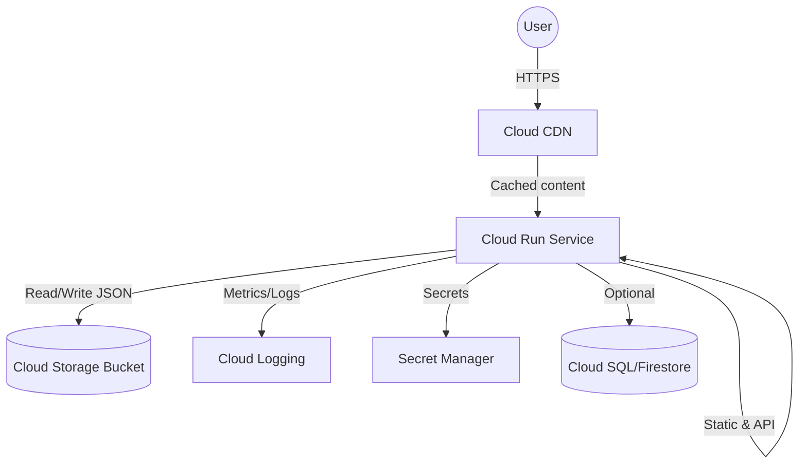

# Cloud Run Notes Backend

Production-ready FastAPI backend that serves a server-rendered notes page and JSON API, optimized for Google Cloud Run and Cloud CDN. The service persists data to Cloud Storage (falling back to local disk for local development) and ships with CI/CD automation, observability, security hardening, and copy/paste deployment commands.

## Project Structure

```
.
├── Dockerfile
├── Procfile
├── README.md
├── requirements.txt
├── setup.cfg
├── src
│   └── app
│       ├── __init__.py
│       ├── config.py
│       ├── logging_config.py
│       ├── main.py
│       ├── middleware
│       │   ├── __init__.py
│       │   └── security.py
│       ├── routers
│       │   ├── __init__.py
│       │   └── notes.py
│       ├── services
│       │   ├── __init__.py
│       │   └── notes_service.py
│       ├── static
│       │   └── style.css
│       ├── storage.py
│       └── templates
│           └── index.html
└── tests
    ├── conftest.py
    └── test_app.py
```

## Quickstart (Local)

```bash
python -m venv .venv && source .venv/bin/activate
pip install -r requirements.txt
APP_ENVIRONMENT=local APP_ENFORCE_HTTPS=false uvicorn app.main:app --reload --port 8080 --app-dir src
```

Visit `http://localhost:8080` for the server-rendered page and `http://localhost:8080/api/docs` for interactive API docs.

Run tests and linting:

```bash
pytest
flake8 src tests
```

## API & Pages

- `GET /` – server-side rendered notes page (HTML).
- `GET /health` – health probe used by Cloud Run and Docker health check.
- `GET /metrics` – lightweight operational metrics.
- `GET /api/v1/notes` – list notes.
- `POST /api/v1/notes` – create note with validation.
- `GET /api/v1/notes/{id}` – fetch note by ID.
- `DELETE /api/v1/notes/{id}` – delete note.

## Configuration

Environment variables (prefix `APP_`):

| Variable | Default | Description |
| --- | --- | --- |
| `APP_APP_NAME` | `FastAPI Cloud Run Starter` | Display name |
| `APP_ENVIRONMENT` | `local` | Environment label |
| `APP_LOG_LEVEL` | `INFO` | Logging level |
| `APP_GCS_BUCKET` | _unset_ | Cloud Storage bucket for persistence |
| `APP_STORAGE_PATH` | `/tmp/cloudrun-starter` | Local persistence path |
| `APP_ENFORCE_HTTPS` | `false` | Force HTTPS redirects (enabled in Docker/Cloud Run) |
| `APP_ALLOW_ORIGINS` | `*` | CORS allowed origins |

Secrets (API keys, DB passwords) should be stored in **Secret Manager** and exposed to the service via `--set-secrets` (see deployment section).

Copy `.env.example` to `.env` for local development and adjust values as needed. The app automatically loads `.env` when present.

## Architecture & GCP Integration

Mermaid diagram showing Cloud Run, Cloud Storage, and Cloud CDN:



**How components work together**

- **Cloud Run** hosts the FastAPI container with autoscaling, health checks, HTTPS redirects, and non-root runtime user.
- **Cloud CDN** caches the server-rendered homepage and static assets to reduce latency and protect Cloud Run from bursts.
- **Cloud Storage** persists notes (`notes.json`) and static assets; the app falls back to local storage when the bucket is not configured, making local dev painless.
- **Optional Cloud SQL/Firestore** can be wired in by replacing `NotesService` with a database-backed repository without changing the API contract.
- **Secret Manager** stores sensitive env vars (e.g., DB passwords, API keys) and is wired through Cloud Run's `--set-secrets` flag in the deployment commands.

## Deployment (copy/paste ready)

Prerequisites: authenticated `gcloud`, enabled Artifact Registry & Cloud Run APIs, and a Storage bucket for persistence.

```bash
PROJECT_ID="your-gcp-project"
REGION="us-central1"
SERVICE="notes-api"
REPO="cloud-run"
IMAGE="${REGION}-docker.pkg.dev/${PROJECT_ID}/${REPO}/${SERVICE}:$(git rev-parse --short HEAD)"
BUCKET="your-notes-bucket"

# Build and push image to Artifact Registry
gcloud auth configure-docker ${REGION}-docker.pkg.dev
gcloud builds submit --tag "$IMAGE" .

# Deploy to Cloud Run with health checks, min instances, and env vars
gcloud run deploy "$SERVICE" \
  --image="$IMAGE" \
  --platform=managed \
  --region="$REGION" \
  --allow-unauthenticated \
  --set-env-vars "APP_ENVIRONMENT=production,APP_GCS_BUCKET=$BUCKET,APP_ENFORCE_HTTPS=true" \
  --min-instances=1 \
  --max-instances=20 \
  --cpu=1 \
  --memory=512Mi \
  --port=8080

# Connect a Cloud Storage bucket (already referenced above)
gcloud storage buckets create gs://$BUCKET --project "$PROJECT_ID" --location "$REGION" --uniform-bucket-level-access

# Attach secrets from Secret Manager (example)
gcloud secrets create notes-api-secret --replication-policy=automatic --data-file=/path/to/secret.txt
gcloud run services update "$SERVICE" \
  --region="$REGION" \
  --set-secrets APP_SECRET_KEY=notes-api-secret:latest

# Enable Cloud CDN in front of Cloud Run (via external HTTP(S) Load Balancer)
# 1. Create serverless NEG for Cloud Run
CLOUD_RUN_URL=$(gcloud run services describe "$SERVICE" --platform managed --region "$REGION" --format='value(status.url)')
gcloud compute network-endpoint-groups create ${SERVICE}-neg \
  --region="$REGION" \
  --network-endpoint-type=SERVERLESS  \
  --cloud-run-service="$SERVICE"
# 2. Create backend service with CDN
gcloud compute backend-services create ${SERVICE}-backend \
  --load-balancing-scheme=EXTERNAL \
  --protocol=HTTPS \
  --enable-cdn
gcloud compute backend-services add-backend ${SERVICE}-backend \
  --global \
  --network-endpoint-group=${SERVICE}-neg \
  --network-endpoint-group-region="$REGION"
# 3. Create URL map, target HTTPS proxy, and forwarding rule (TLS cert required)
# (Replace with your managed certificate and static IP.)
```

> The CDN steps require a HTTPS load balancer; the commands above scaffold the backend service and NEG. Attach your managed certificate, URL map, and forwarding rule per [Google's guide](https://cloud.google.com/cdn/docs/setting-up-cdn-with-serverless-backend).

## Production Best Practices (implemented)

- **Logging & Monitoring**: Structured console logs enriched with request IDs. Cloud Run ships logs to Cloud Logging automatically; add alert policies on health/latency.
- **Security headers**: `SecurityHeadersMiddleware` injects CSP, X-Frame-Options, Referrer-Policy, and only enables HSTS when HTTPS is enforced or the request arrives over TLS.
- **HTTPS enforcement**: `APP_ENFORCE_HTTPS=true` adds FastAPI's HTTPS redirect middleware.
- **Request validation**: Pydantic models validate payloads; `RequestValidationError` handler returns actionable JSON.
- **Error handling**: Centralized exception handlers respond with 422/500 while logging stack traces.
- **Caching & CDN**: Static assets under `/static` are cacheable by CDN; homepage can be cached at edge while API responses remain dynamic.
- **Secrets**: Retrieve secrets from Secret Manager via `--set-secrets` during deployment; none are committed to source.
- **Autoscaling**: Deployment command sets min/max instances; adjust concurrency/CPU per workload.
- **Least privilege container**: Non-root `appuser`, slim base image, and `HEALTHCHECK` ensure readiness.

## CI/CD (GitHub Actions)

Workflow at `.github/workflows/deploy.yaml`:

- Lint and test on every push/PR.
- Build and push container to Artifact Registry using `gcloud` with Workload Identity Federation (OIDC) or a JSON key stored as `GCP_SA_KEY` secret.
- Deploy to Cloud Run with versioned tags (`$GITHUB_SHA`).

Secrets used:

- `GCP_PROJECT_ID`, `GCP_REGION`, `CLOUD_RUN_SERVICE`, `ARTIFACT_REPO`, `GCP_SA_KEY` (base64 service account key) or OIDC configuration.

Tagging strategy: images are tagged with the short git SHA and `latest` for easy rollback while keeping immutability for deployments.

## Extending with Cloud SQL or Firestore

Swap `NotesService` with a database repository while keeping the router unchanged. Add the driver dependency, configure connection vars via Secret Manager, and update the Dockerfile if native libs are required.

## Observability Recipes

- Enable Cloud Run request logs and metrics in Cloud Monitoring dashboards.
- Add an uptime check to `/health` and alert on 5xx rate or latency p95.
- Use `gcloud logs tail --platform=managed --service=$SERVICE` for live debugging.

## Running as a Cloud Run Job for Maintenance

You can run ad-hoc migrations or cleanup tasks as Cloud Run Jobs by packaging a management script under `bin/` and invoking `gcloud run jobs execute`.

## License

MIT
